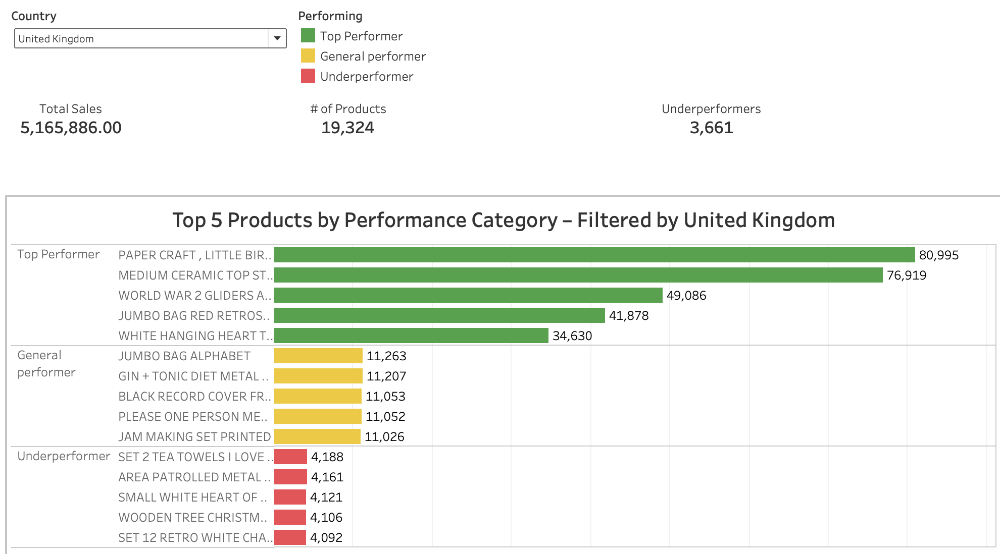

# E-commerce Sales Analysis: Optimizing Products and Segmenting Customers
This project analyzes sales data from an online craft store to identify top products, seasonal trends, and customer segments while offering actionable recommendations to optimize inventory and boost profitability.¶

## Project Contents

- `e-commerce-sales.ipynb` – Jupyter notebook for exploratory data analysis
- `products_workbook.twbx` – Tableau dashboard showing top performers, general performers  and underperformerse by country
- `dashboard_preview.png` – Screenshot preview of the dashboard

##  Key Insights

-Sales data identifies top-performing products and underperforming segments.  
- RFM analysis reveals high-value customer groups and those needing re-engagement.  
- Frequent, high-spending customers are ideal for loyalty campaigns.  
- Underperforming segments present opportunities for targeted promotions.  
- Data supports strategies to enhance customer retention and drive sales growth.

## Dashboard Preview

## How to Use

- Open `products_workbook.twbx` in Tableau (Public or Desktop)
- Run `e-commerce-sales.ipynb` in Jupyter (install pandas, seaborn)

## 🔗 Dataset

Retail dataset from [Kaggle](https://www.kaggle.com/datasets/ishanshrivastava28/tata-online-retail-dataset)

## 👤 Author

**Lina Zaleska** – Data Analyst  
